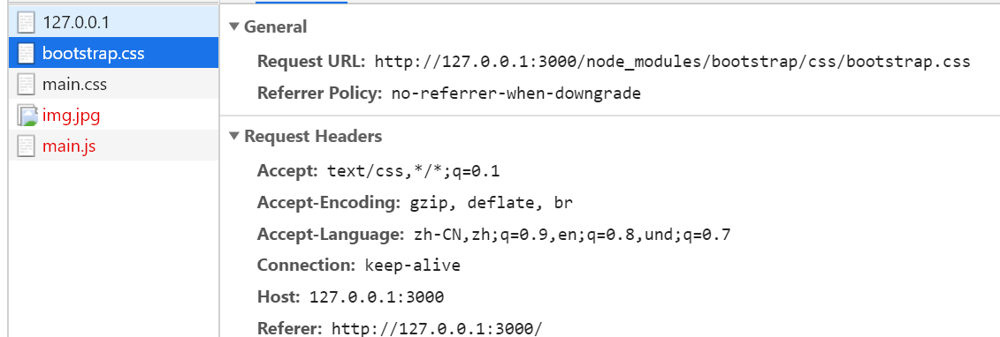
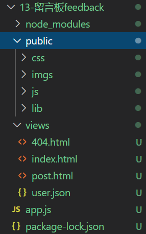
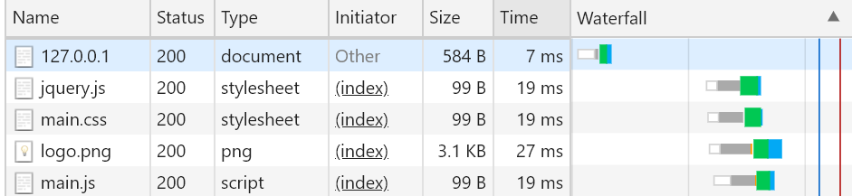
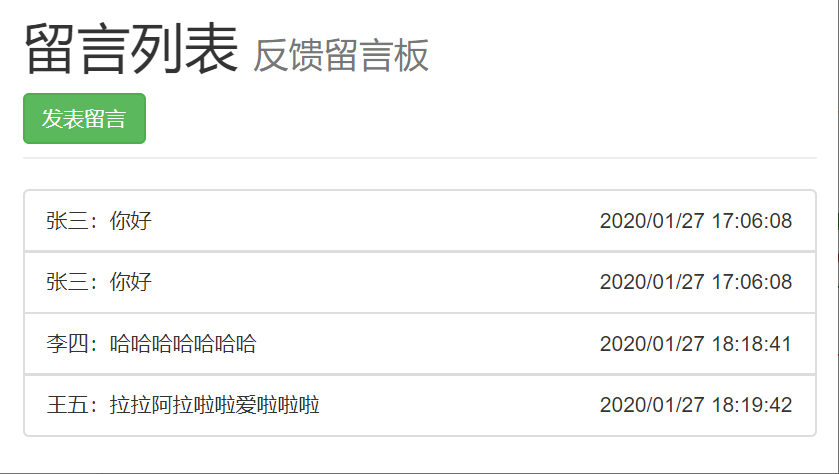
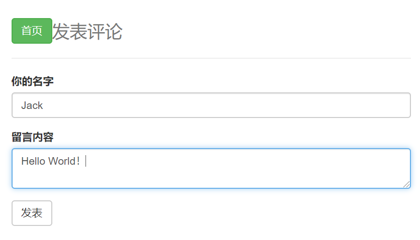
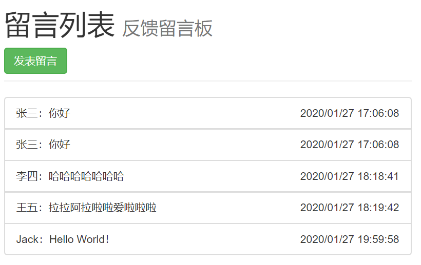

# feedback
使用node作为后台的简易反馈留言板


## 实现简易留言板feedback

### 前言

浏览器收到响应内容后，就要开始从上到下依次解析，当在解析的过程中，如果发现：

- link
- script
- img
- iframe
- video
- audio
- ......

带有src或者href（link）属性标签（具有外链的资源）的时候，浏览器会自动对这些资源发起新的请求，如果我们只对一个页面资源进行处理的话，index.html中的外链资源则不可以请求到

例如以下

```html
<!DOCTYPE html>
<html lang="en">
<head>
    <meta charset="UTF-8">
    <meta name="viewport" content="width=device-width, initial-scale=1.0">
    <meta http-equiv="X-UA-Compatible" content="ie=edge">
    <title>留言板</title>
    <link rel="stylesheet" href="../node_modules/bootstrap/css/bootstrap.css">
    <link rel="stylesheet" href="css/main.css">
</head>
<body>
    你好
    
    <script src="js/main.js"></script>
</body>
</html>
```

```javascript
var http = require('http');
var fs = require('fs');
//简写方式
http.createServer(function(req, res){
    var url = req.url;
    if(url === '/'){
        fs.readFile('./views/index.html', function(err, data){
            if(err) return res.end('404 Not Found!');
            res.end(data);
        })
    }
}).listen(3000, function(error){
    if(error) return console.log('error!');
    console.log('running....');
})
```

所显示的页面就会一直处在挂起的状态，其他的资源得不到加载权限。



### 处理网站中的静态资源

为了方便统一处理资源，我们将所有的静态资源都放到public目录中，如以下的目录结构，目的是开放指定资源，有服务端进行控制。而相对于Apache来说，Apache会将所有资源暴露出来，而比较严密的Node则可以得到控制。



当访问到public目录下的资源时，就可以统一处理那些需要加载的资源了。通过`url.indexOf('/public/') === 0`进行判断，所请求的方式是：

- /public/css/main.css
- /publis/js/main.css
- /publis/imgs/logo.png
- /public/lib/jquery.js

```html
<!DOCTYPE html>
<html lang="en">
<head>
    <meta charset="UTF-8">
    <meta name="viewport" content="width=device-width, initial-scale=1.0">
    <meta http-equiv="X-UA-Compatible" content="ie=edge">
    <title>留言板</title>
    <!-- 
		注意：在服务器中，文件中的路径不适用相对路径
		因为这时候的所有文件资源都通过url标识来进行获取
		在服务器中开放了  /public/ 目录
		所以这里的请求路径都写成  /public/.....
	-->
    <link rel="stylesheet" href="/public/lib/jquery.js">
    <link rel="stylesheet" href="/public/css/main.css">
</head>
<body>
    你好
    
    <script src="/public/js/main.js"></script>
</body>
</html>
```

注意：

- 在服务器中，文件中的路径不适用相对路径

- 因为这时候的所有文件资源都通过url标识来进行获取

- 在服务器中开放了  `/public/` 目录

- 所以这里的请求路径都写成  `/public/.....`

- `/`  指的是url根路径的意思

- 发送请求时，浏览器真正发送请求的时候最终会在http://127.0.0.1:3000 后面进行拼接。例如Request URL: 

  http://127.0.0.1:3000/public/css/main.css

```javascript
var http = require('http');
var fs = require('fs');

http.createServer(function(req, res){
    var url = req.url;
    if(url === '/'){
        fs.readFile('./views/index.html', function(err, data){
            if(err) return res.end('404 Not Found!');
            res.end(data);
        })
    }else if(url.indexOf('/public/') === 0){
        // 当访问到public目录下的资源时，就可以统一处理那些需要加载的资源了。通过`url.indexOf('/public/') === 0`进行判断，所请求的方式是：

        //  /public/css/main.css
        //  /publis/js/main.css
        //  /publis/imgs/logo.png
        //  /public/lib/jquery.js
        // 使用readFile时必须加上  .  
        fs.readFile('.' + url, function(err, data){
            if(err) return res.end('404 Not Found!');
            res.end(data)
        });
    }else{
        fs.readFile('./views/404.html',function(err, data){
            if(err) return res.end('404 Not Found!');
            res.end(data);
        })
    }
}).listen(3000, function(error){
    if(error) return console.log('error!');
    console.log('running....');
})
```



### 渲染首页

在需要请求的地方，我们将之写入url地址，写入基本样式，并使用art-template模板引擎

```html
<!DOCTYPE html>
<html lang="en">
<head>
    <meta charset="UTF-8">
    <meta name="viewport" content="width=device-width, initial-scale=1.0">
    <meta http-equiv="X-UA-Compatible" content="ie=edge">
    <title>留言板</title>
    <link rel="stylesheet" href="/public/lib/bootstrap/css/bootstrap.css">
</head>
<body>
    <div class="header container">
        <div class="page-header">
            <h1>留言列表  <small>反馈留言板</small></h1>
            <a class="btn btn-success" href="/post">发表留言</a>
        </div>
    </div>
    <div class="comments container">
        <ul class="list-group">
            {{each comments}}
            <li class="list-group-item">{{$value.name}}说：{{$value.message}}<span class="pull-right">{{$value.dateTime}}</span></li>
            {{/each}}
        </ul>
    </div>
</body>
</html>
```

在app.js中判断各类url的情况处理

- 首页：路径为 `/`
  - 读取用户留言信息user.json文件，将之赋予comments数组
  - 读取index.html文件，并将user.json文件的数据替换并展现到页面中
- 以 `/public/` 开头的url
  - 读取相应路径的文件，并返回结果
- 发表留言页面： 路径为`/post`
  - 读取views下的post.html，并返回页面
- 带有参数的提交  `/commit`
  - 首先将url中的query对象获取
  - 设置当前用户信息和留言内容
  - 将新的数组对象写入user.json文件当中
  - 向客户端返回状态码302（表示重定向）
  - 设置头部信息中的Location到根路径`/`，即可返回到首页
  - 返回结束，看到首页新留言列表
- 其余请求路径
  - 输出404.html页面

完整app.js

```javascript
var http = require('http');
var fs = require('fs');
var url = require('url');
var template = require('art-template');

var comments = [];

http.createServer(function (req, res) {
    var parseObj = url.parse(req.url, true);
    var pathName = parseObj.pathname;
    if (pathName === '/') {
        fs.readFile('./views/user.json', function (err, data) {
            if (err) return console.log('error');
            var data = JSON.parse(data);
            comments = data;
        })
        fs.readFile('./views/index.html', function (err, data) {
            if (err) return res.end('404 Not Found!');
            var result = template.render(data.toString(), {
                comments: comments
            })
            res.end(result);
        })
    } else if (pathName.indexOf('/public/') === 0) {
        fs.readFile('.' + pathName, function (err, data) {
            if (err) return res.end('404 Not Found!');
            res.end(data);
        });
    } else if (pathName === '/post') {
        fs.readFile('./views/post.html', function (err, data) {
            if (err) return res.end('404 Not Found!');
            res.end(data);
        })
    } else if (pathName === '/commit') {
        var comment = parseObj.query;
        comment.dateTime = formatDate(new Date());
        comments.push(comment);
        var commentStr = JSON.stringify(comments);
        fs.writeFile('./views/user.json', commentStr, function (err) {
            if (err) return console.log('error!');
            console.log('记录成功！');
        })
        res.statusCode = 302;
        res.setHeader('Location', '/');
        res.end();
    } else {
        fs.readFile('./views/404.html', function (err, data) {
            if (err) return res.end('404 Not Found!');
            res.end(data);
        })
    }
}).listen(3000, function (error) {
    if (error) return console.log('error!');
    console.log('running....');
})

function formatDate(date) {

    var y = date.getFullYear();
    var m = date.getMonth() + 1;
    var d = date.getDate();
    var h = date.getHours();
    var mm = date.getMinutes();
    var s = date.getSeconds();
    return y + '/' + isZero(m) + '/' + isZero(d) + ' ' + isZero(h) + ':' + isZero(mm) + ':' + isZero(s);
}
function isZero(m) {
    return m < 10 ? '0' + m : m
}
```

完整post页面

```html
<!DOCTYPE html>
<html lang="en">
<head>
    <meta charset="UTF-8">
    <meta name="viewport" content="width=device-width, initial-scale=1.0">
    <meta http-equiv="X-UA-Compatible" content="ie=edge">
    <title>发表留言</title>
    <link rel="stylesheet" href="/public/lib/bootstrap/css/bootstrap.css">
</head>
<body>
    <div class="header container">
        <div class="page-header">
            <h1><a class="btn btn-success" href="/">首页</a><small>发表评论</small></h1>
        </div>
    </div>
    <div class="comments container">
        <form action="/commit" method="GET">
            <div class="form-group">
                <label for="input_name">你的名字</label>
                <input type="text" class="form-control" required minlength="2" maxlength="10" id="input_name" name="name" placeholder="输入你的名字">
            </div>
            <div class="form-group">
                <label for="textarea_message">留言内容</label>
                <textarea type="text" class="form-control" required minlength="5" maxlength="520" id="textarea_message" name="message"></textarea>
            </div>
            <button type="submit" class="btn btn-default">发表</button>
        </form>
    </div>
</body>
</html>
```

最终显示的效果





